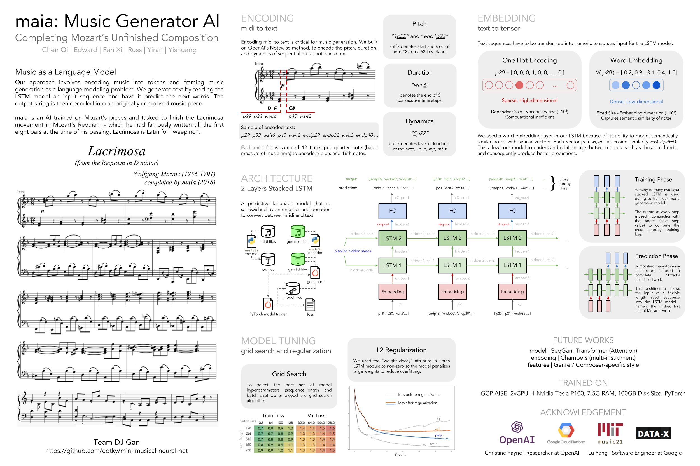

#  Mini Musical Neural Net

Here, we attempt to dissect Open AI Scholar Christine Payne's project on Musical Neural Net and further her work to complete some unfinished compositions by famous musicians.

## Getting Started

These instructions will get you a copy of the project up and running on your local machine.

1. Clone this Github repo into your local machine.

2. You will need to have the following packages install: music21, jupyter, numpy

3. Open the iPython Notebooks and follow the tutorial inside.

## Basic Model Pipeline

1. midi files for training goes into ***midi-files***

2. encoder takes input midi files and converts them to text files into ***txt-files/notewise/note_range62/sample_freq12/***

3. **word_model** takes text files as input and outputs generated text files into ***txt-files/notewise/custom***

4. **notewise-decoder.py** takes text files and decodes them back to midi files into ***output-midi-files***

## Important Files / Folders

***notewise_decoder.py***  
a script to decode any generated txt file into midi  

***word_model.py***  
our baseline 2-layer lstm model (for cpu)  

***notebooks/2018-11-14_model02-cuda.ipynb***  
latest version of our 2-layer lstm model (for gpu)  
experimenting with hyperparameters

***output-midi-files/notewise/custom/run01_2018-11-14/***  
contains samples of generated files during training  

## Poster for Project

## Acknowledgement

- Christine Payne, Open AI Scholar, for her amazing work!
- DJ Gan Team @ Berkeley MEng

## Contact

If you face any issues or have any questions, please contact me at edwardtky@berkeley.edu
